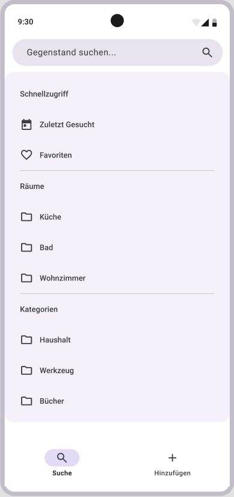
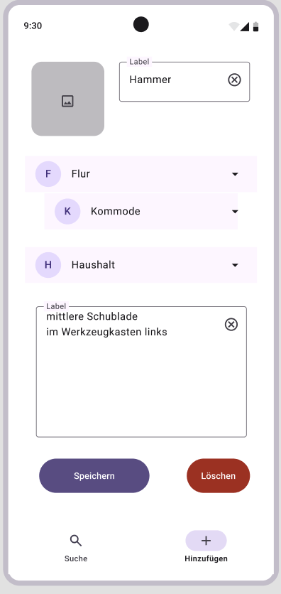
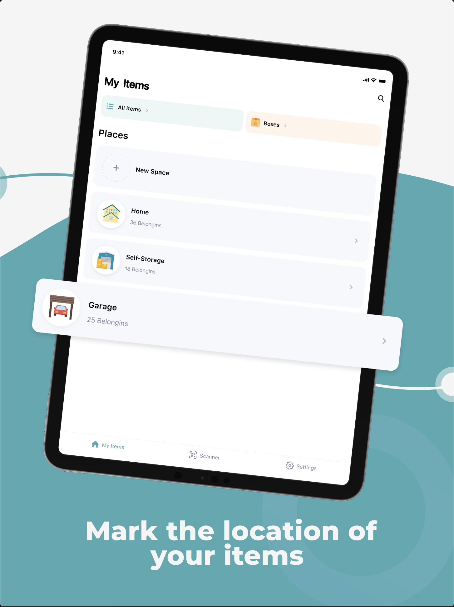
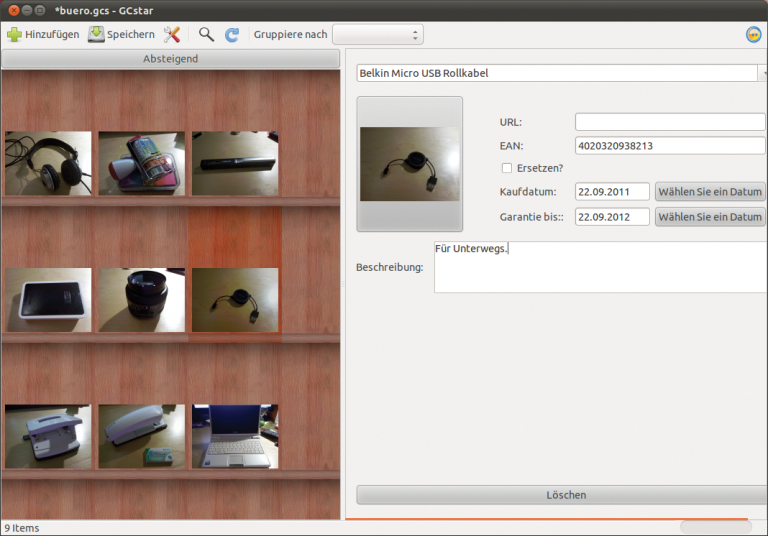

# Mockups für Endergebnis

## Click Dummy

Mit figma.com wurde ein Click Dummy erstellt:
https://www.figma.com/proto/ZfexXX2ydsoo5tId95iKOq/Shelfmaster?node-id=654-952&p=f&t=bBb5wdpk5WlmXeCT-1&scaling=scale-down&content-scaling=fixed&page-id=606%3A9&starting-point-node-id=654%3A952

# Ähnliche Anwendungen
Es existieren bereits Softwarelösungen, die dasselbe Ziel verfolgen, z.B.:

- [MyStuff](https://apps.apple.com/de/app/my-stuff-finding-things/id1590839203?l=en-GB) (iOS)

- [GCstar](https://gitlab.com/GCstar/GCstar) (OpenSource)

Außerdem gibt es viele Tools zur Inventar-/ Lagerverwaltung für Unternehmen, die u.A. auch unsere Funktionlitäten abdecken.
Namenhafte Beispiele sind z.B.:
- [Sortly](https://www.sortly.com/)
- [Xentral](https://xentral.com/de)
- [Zoho](https://www.zoho.com/de-de/inventory/)
